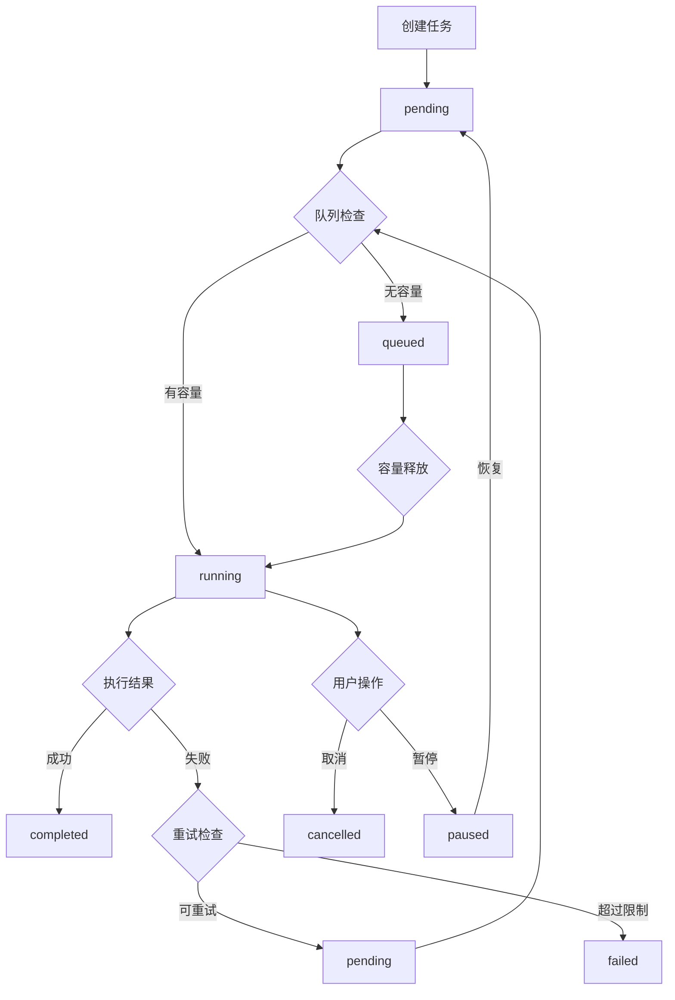

# 任务生命周期设计（Task Lifecycle）

更新时间：2025-08-17 11:29 (Asia/Shanghai)

## 双域模型说明

本系统存在两套状态域（实现分别位于 `request_queue` 与 `task_manager/enhanced_task_manager`）：

- 全局请求队列（Request Queue，下载主链路）
  - 状态：`queued` → `running` → `done | failed`
  - 支持操作：暂停/恢复整队列（`/api/queue/pause|resume`），容量设置（`/api/queue/capacity`），请求级取消/提权（`/api/requests/{id}/cancel|prioritize`）
  - 通道隔离：`requires_cookie` 与 `no_cookie` 双通道，各自独立容量
  - 订阅互斥：同一订阅任务串行

- 手动任务管理器（Manual Tasks，后台维护/手动触发）
  - 状态：`pending`/`queued`/`running`/`completed`/`failed`/`cancelled`/`paused`
  - 对应 API：`/api/tasks/*` 与 `/api/subscriptions/{id}/download`、`/api/subscriptions/{id}/tasks`

以下 Mermaid 流转图适用于“手动任务管理器”域。

## 任务状态流转图（手动任务管理器）



## 任务状态详解

### 1. pending（等待中）
- **描述**：任务已创建，等待调度执行
- **触发条件**：
  - 新任务创建
  - 失败任务重试
  - 暂停任务恢复
- **可转换状态**：`running`, `cancelled`

### 2. queued（排队中）
- **描述**：任务在队列中等待，因容量限制无法立即执行
- **触发条件**：队列容量已满
- **可转换状态**：`running`, `cancelled`

### 3. running（运行中）
- **描述**：任务正在执行
- **触发条件**：获得执行资源
- **可转换状态**：`completed`, `failed`, `cancelled`, `paused`
- **执行超时**：根据任务类型设置不同超时时间

### 4. completed（已完成）
- **描述**：任务成功完成
- **触发条件**：任务执行成功
- **终态**：不可再转换

### 5. failed（失败）
- **描述**：任务执行失败且不再重试
- **触发条件**：
  - 执行异常且超过重试限制
  - 致命错误（如权限问题）
- **终态**：不可再转换

### 6. cancelled（已取消）
- **描述**：任务被用户或系统取消
- **触发条件**：
  - 用户手动取消
  - 系统自动取消（如订阅删除）
- **终态**：不可再转换

### 7. paused（已暂停）
- **描述**：任务被暂停，可恢复执行
- **触发条件**：用户暂停或系统暂停
- **可转换状态**：`pending`, `cancelled`

## 任务类型与超时配置（手动任务管理器）

### 下载任务（download）
- **默认超时**：1800秒（30分钟）
- **重试次数**：3次
- **重试间隔**：指数退避（1分钟、2分钟、4分钟）

### 扫描任务（scan）
- **默认超时**：300秒（5分钟）
- **重试次数**：2次
- **重试间隔**：固定30秒

### 关联任务（associate）
- **默认超时**：120秒（2分钟）
- **重试次数**：2次
- **重试间隔**：固定10秒

### 检查任务（check）
- **默认超时**：60秒（1分钟）
- **重试次数**：1次
- **重试间隔**：固定5秒

## 优先级与调度

### 优先级范围
- **1-3**：高优先级（用户手动触发）
- **4-6**：中优先级（系统自动调度）
- **7-10**：低优先级（后台维护任务）

### 调度规则
1. **优先级优先**：数字越小优先级越高
2. **FIFO原则**：同优先级按创建时间排序
3. **通道隔离（全局请求队列）**：`requires_cookie`/`no_cookie` 通道独立容量与并发
4. **订阅互斥（全局请求队列）**：同一订阅串行，避免竞争

## 错误处理与重试机制

### 可重试错误
- **网络超时**：`TimeoutError`
- **临时网络错误**：`ConnectionError`
- **服务器繁忙**：`503 Service Unavailable`
- **限流错误**：`429 Too Many Requests`

### 不可重试错误
- **认证失败**：`401 Unauthorized`
- **权限不足**：`403 Forbidden`
- **资源不存在**：`404 Not Found`
- **参数错误**：`400 Bad Request`
- **磁盘空间不足**：`DiskSpaceError`

### 重试策略
```python
def calculate_retry_delay(attempt: int, base_delay: int = 60) -> int:
    """计算重试延迟时间（指数退避）"""
    return min(base_delay * (2 ** attempt), 300)  # 最大5分钟
```

## 任务监控与清理

### 状态监控
- **心跳检测**：每30秒检查运行中任务状态
- **超时检测**：自动终止超时任务
- **僵尸进程清理**：清理异常退出的子进程

### 历史任务清理
- **保留期限**：完成任务保留7天，失败任务保留30天
- **清理策略**：每日凌晨2点自动清理
- **手动清理**：提供API接口手动清理

### 性能监控
- **执行时间统计**：记录各类任务平均执行时间
- **成功率统计**：按任务类型统计成功率
- **资源使用监控**：CPU、内存、磁盘IO监控

## 并发与容量控制（全局请求队列）

### 队列容量
- **通道容量**：通过 `POST /api/queue/capacity` 设置，参数：`requires_cookie`、`no_cookie`
- **运行时调整**：支持在线调整容量并即时生效
- **暂停/恢复**：`POST /api/queue/pause|resume`（支持 scope）

### 订阅级互斥
- **互斥锁**：同一订阅任务串行执行
- **锁超时**：防止死锁，最大锁定时间2小时
- **锁释放**：任务完成或失败时自动释放

### 资源保护
- **内存限制**：单任务最大内存使用500MB
- **磁盘IO限制**：限制并发写入操作
- **网络连接池**：复用HTTP连接，减少资源消耗

## 日志与审计

### 任务日志
- **创建日志**：记录任务创建时间、参数
- **状态变更日志**：记录每次状态转换
- **执行日志**：记录执行过程中的关键信息
- **错误日志**：详细记录错误信息和堆栈

### 审计追踪
- **操作记录**：记录用户操作（取消、暂停、恢复）
- **系统事件**：记录系统自动操作
- **性能指标**：记录任务执行性能数据
