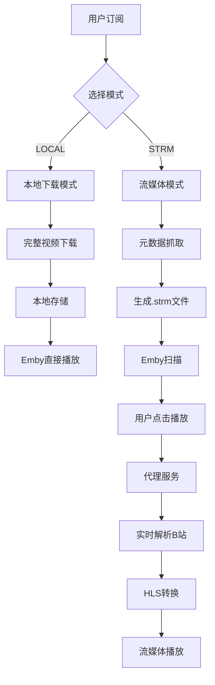
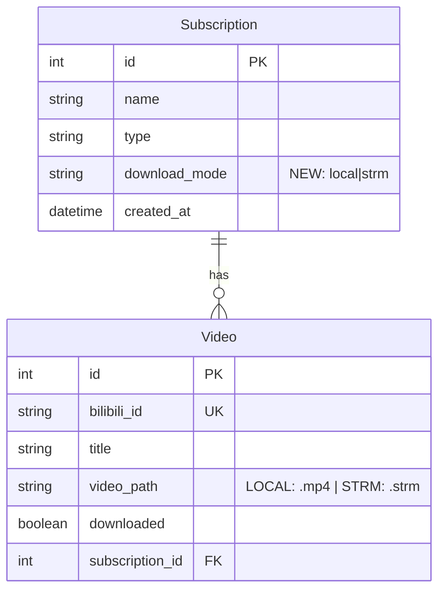
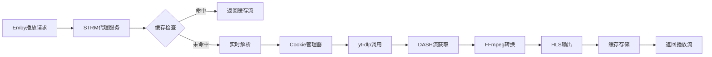
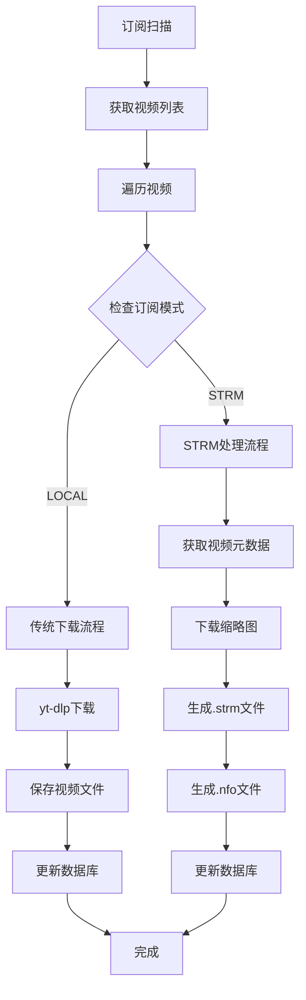
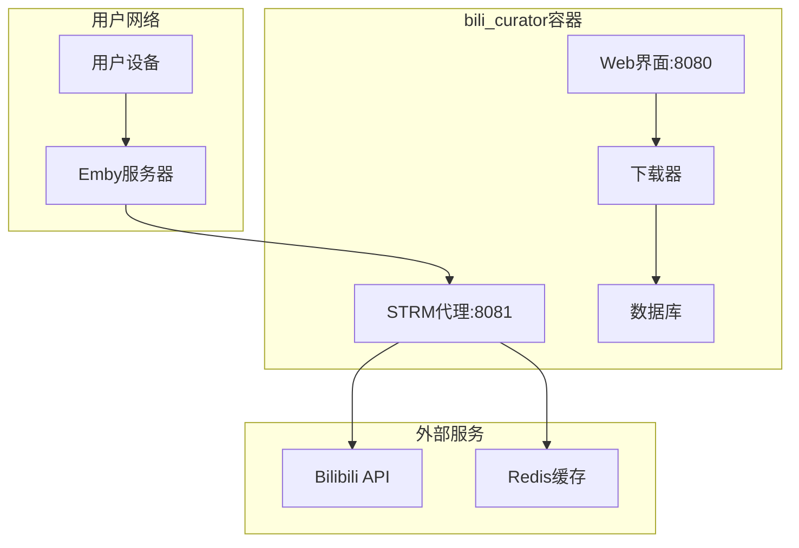

# bili_curator V7 STRM架构设计文档

## 版本架构演进

### V6 → V7 升级路径
```
V6 (当前稳定版)           V7 (STRM扩展版)
├── 本地下载模式    →     ├── 本地下载模式 (保持不变)
├── 订阅管理        →     ├── 订阅管理 (扩展模式选择)
├── Cookie管理      →     ├── Cookie管理 (复用)
├── 任务调度        →     ├── 任务调度 (扩展STRM任务)
└── Web界面         →     ├── Web界面 (扩展STRM界面)
                          └── STRM代理服务 (新增)
```

## 系统架构概览



## 核心组件设计

### 1. 数据层架构

#### 数据模型关系


#### 存储路径策略
```
项目根目录/
├── downloads/          # LOCAL模式 (现有)
│   ├── UP主-张三/
│   │   ├── 视频1.mp4
│   │   ├── 视频1.info.json
│   │   └── 视频1.jpg
│   └── 合集-教程/
└── strm/              # STRM模式 (新增)
    ├── UP主-李四/
    │   ├── 视频1.strm
    │   ├── 视频1.nfo
    │   └── 视频1.jpg
    └── 关键词-Python/
```

### 2. 服务层架构

#### 代理服务组件


#### 缓存策略设计
```python
# 多层缓存架构
class CacheStrategy:
    L1_MEMORY = {
        'ttl': 300,      # 5分钟
        'max_size': 100, # 100个视频
        'type': 'LRU'
    }
    
    L2_REDIS = {
        'ttl': 1800,     # 30分钟
        'max_size': 1000,
        'type': '热点数据'
    }
    
    L3_DISK = {
        'ttl': 3600,     # 1小时
        'type': 'HLS片段缓存'
    }
```

### 3. 下载器架构扩展

#### 处理流程分支


#### 文件生成逻辑
```python
# STRM文件内容模板
STRM_TEMPLATE = "http://localhost:{port}/api/v1/stream/{bvid}"

# NFO文件内容模板
NFO_TEMPLATE = """<?xml version="1.0" encoding="UTF-8"?>
<movie>
    <title>{title}</title>
    <plot>{description}</plot>
    <premiered>{upload_date}</premiered>
    <studio>{uploader}</studio>
    <director>{uploader}</director>
    <genre>Bilibili</genre>
    <genre>{subscription_type}</genre>
    <runtime>{duration}</runtime>
    <thumb>{thumbnail_path}</thumb>
</movie>"""
```

## API接口设计

### 1. RESTful API扩展

#### 订阅管理接口
```yaml
# 创建订阅 (扩展现有接口)
POST /api/subscriptions
{
  "name": "UP主-张三",
  "type": "uploader",
  "uploader_id": "123456",
  "download_mode": "strm"  # 新增字段
}

# 获取订阅列表 (响应扩展)
GET /api/subscriptions
[
  {
    "id": 1,
    "name": "UP主-张三",
    "download_mode": "strm",
    "storage_usage": "2.5MB",  # STRM模式显示元数据大小
    "video_count": 50
  }
]
```

#### STRM专用接口
```yaml
# 流媒体代理接口
GET /api/v1/stream/{bvid}
Response: HLS流数据

# STRM服务状态
GET /api/strm/status
{
  "proxy_running": true,
  "cache_entries": 45,
  "active_streams": 3,
  "cache_hit_rate": 0.85
}

# 缓存管理
DELETE /api/strm/cache
POST /api/strm/cache/refresh/{bvid}
```

### 2. WebSocket实时通信
```yaml
# 播放状态推送
ws://localhost:8080/ws/strm/status
{
  "type": "stream_start",
  "bvid": "BV1234567890",
  "quality": "720p",
  "timestamp": "2025-08-23T08:00:00Z"
}
```

## 前端UI设计

### 1. 订阅创建界面
```html
<!-- 模式选择组件 -->
<div class="download-mode-selector">
  <div class="mode-option" data-mode="local">
    <input type="radio" name="download_mode" value="local" checked>
    <div class="mode-info">
      <h3>📁 本地下载</h3>
      <p>完整视频文件，离线播放</p>
      <span class="storage-info">约500MB/视频</span>
    </div>
  </div>
  
  <div class="mode-option" data-mode="strm">
    <input type="radio" name="download_mode" value="strm">
    <div class="mode-info">
      <h3>📺 在线流媒体</h3>
      <p>轻量级文件，按需播放</p>
      <span class="storage-info">约50KB/视频</span>
    </div>
  </div>
</div>
```

### 2. 订阅列表界面
```html
<!-- 订阅卡片组件 -->
<div class="subscription-card strm-mode">
  <div class="mode-badge">📺 STRM</div>
  <h3>UP主-张三</h3>
  <div class="stats">
    <span>视频: 50个</span>
    <span>存储: 2.5MB</span>
    <span class="proxy-status online">代理在线</span>
  </div>
</div>
```

### 3. 系统监控界面
```html
<!-- STRM服务监控面板 -->
<div class="strm-monitor">
  <div class="service-status">
    <h3>🎬 STRM代理服务</h3>
    <span class="status-indicator online">运行中</span>
  </div>
  
  <div class="metrics-grid">
    <div class="metric">
      <label>缓存命中率</label>
      <div class="progress-bar">
        <div class="progress" style="width: 85%">85%</div>
      </div>
    </div>
    
    <div class="metric">
      <label>活跃流数量</label>
      <span class="value">3</span>
    </div>
    
    <div class="metric">
      <label>缓存条目</label>
      <span class="value">45</span>
    </div>
  </div>
</div>
```

## 部署架构

### 1. Docker容器设计
```yaml
# docker-compose.yml
services:
  bili-curator:
    build: .
    ports:
      - "8080:8080"  # Web界面
      - "8081:8081"  # STRM代理服务
    volumes:
      - ./downloads:/app/downloads    # 本地下载目录
      - ./strm:/app/strm             # STRM文件目录
      - ./data:/app/data             # 数据库和配置
    environment:
      - DOWNLOAD_PATH=/app/downloads
      - STRM_PATH=/app/strm
      - STRM_PROXY_PORT=8081
      - STRM_CACHE_TTL=300
    depends_on:
      - redis  # 可选：用于分布式缓存
      
  redis:  # 可选组件
    image: redis:alpine
    volumes:
      - redis_data:/data
```

### 2. 网络架构


## 性能优化策略

### 1. 缓存优化
```python
# 智能缓存策略
class SmartCache:
    def __init__(self):
        self.hot_videos = set()  # 热门视频
        self.user_patterns = {}  # 用户观看模式
        
    def should_cache(self, bvid: str) -> bool:
        # 基于播放频率和用户模式决定缓存策略
        return (
            bvid in self.hot_videos or
            self.predict_user_interest(bvid) > 0.7
        )
```

### 2. 并发控制
```python
# 流量控制和限流
class StreamLimiter:
    def __init__(self):
        self.max_concurrent = 10
        self.rate_limit = "5/minute/ip"
        self.semaphore = asyncio.Semaphore(self.max_concurrent)
        
    async def acquire_stream(self, client_ip: str):
        # 检查并发限制和速率限制
        pass
```

### 3. 资源管理
```python
# 内存和磁盘管理
class ResourceManager:
    def __init__(self):
        self.max_memory = "512MB"
        self.max_disk_cache = "5GB"
        self.cleanup_interval = 3600  # 1小时
        
    async def cleanup_expired_cache(self):
        # 定期清理过期缓存
        pass
```

## 监控和告警

### 1. 关键指标
```yaml
# Prometheus指标定义
metrics:
  - name: strm_cache_hit_rate
    type: gauge
    help: "STRM缓存命中率"
    
  - name: strm_active_streams
    type: gauge
    help: "当前活跃流数量"
    
  - name: strm_response_time
    type: histogram
    help: "STRM响应时间分布"
    
  - name: strm_error_rate
    type: counter
    help: "STRM错误计数"
```

### 2. 告警规则
```yaml
# 告警配置
alerts:
  - name: STRMServiceDown
    condition: strm_proxy_up == 0
    duration: 30s
    severity: critical
    
  - name: STRMHighErrorRate
    condition: rate(strm_error_rate[5m]) > 0.1
    duration: 2m
    severity: warning
    
  - name: STRMLowCacheHitRate
    condition: strm_cache_hit_rate < 0.5
    duration: 5m
    severity: warning
```

## 安全考虑

### 1. 访问控制
```python
# API访问控制
class STRMSecurity:
    def __init__(self):
        self.allowed_origins = ["localhost", "127.0.0.1"]
        self.rate_limits = {"default": "100/hour"}
        
    def validate_request(self, request):
        # 验证请求来源和频率
        pass
```

### 2. 数据保护
```python
# Cookie和敏感数据保护
class DataProtection:
    def __init__(self):
        self.encryption_key = os.getenv("ENCRYPTION_KEY")
        
    def encrypt_cookie(self, cookie_data):
        # 加密存储Cookie
        pass
```

## 故障恢复

### 1. 服务降级
```python
# 降级策略
class FallbackStrategy:
    def __init__(self):
        self.fallback_enabled = True
        
    async def handle_stream_failure(self, bvid: str):
        if self.fallback_enabled:
            # 降级到直接链接（如果可用）
            return await self.get_direct_link(bvid)
        else:
            raise StreamUnavailableError()
```

### 2. 自动恢复
```python
# 健康检查和自动重启
class HealthChecker:
    def __init__(self):
        self.check_interval = 30  # 30秒
        
    async def health_check(self):
        # 检查代理服务健康状态
        # 必要时自动重启组件
        pass
```

---

**文档版本**：v1.0  
**创建日期**：2025-08-23  
**维护者**：bili_curator开发团队
